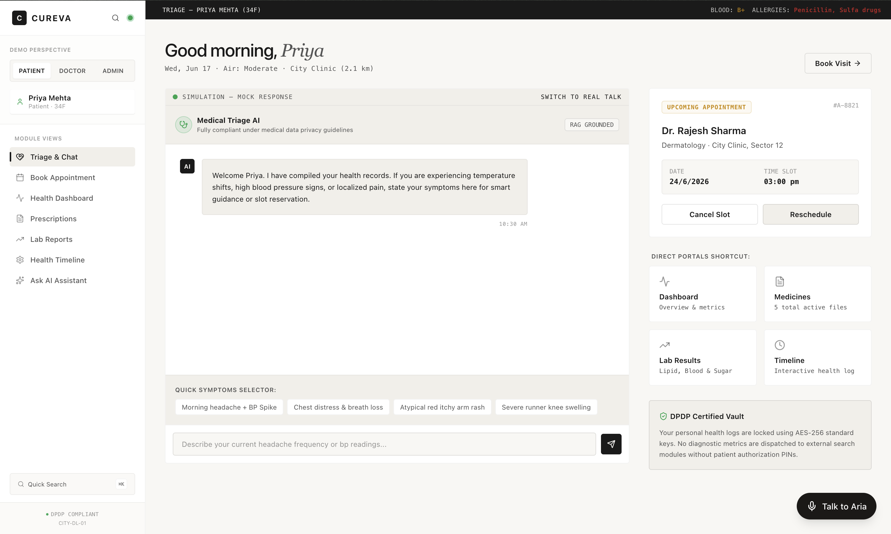
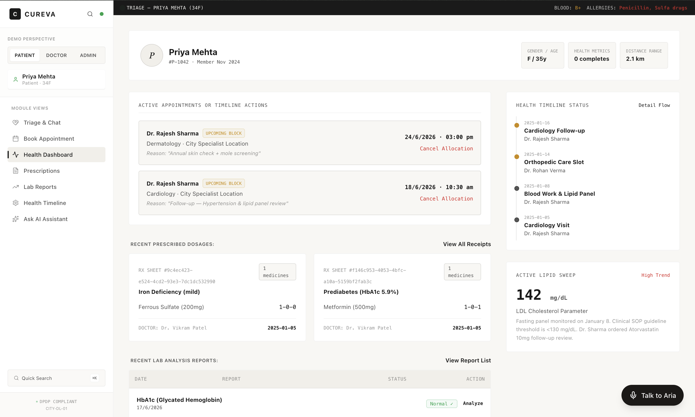
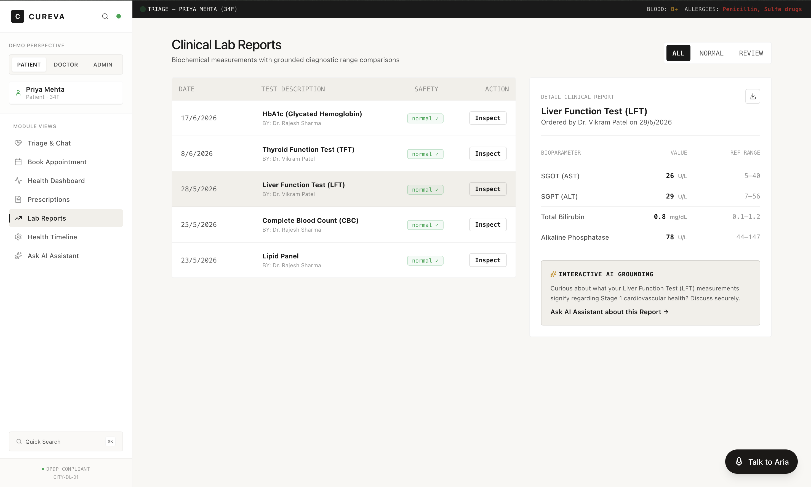
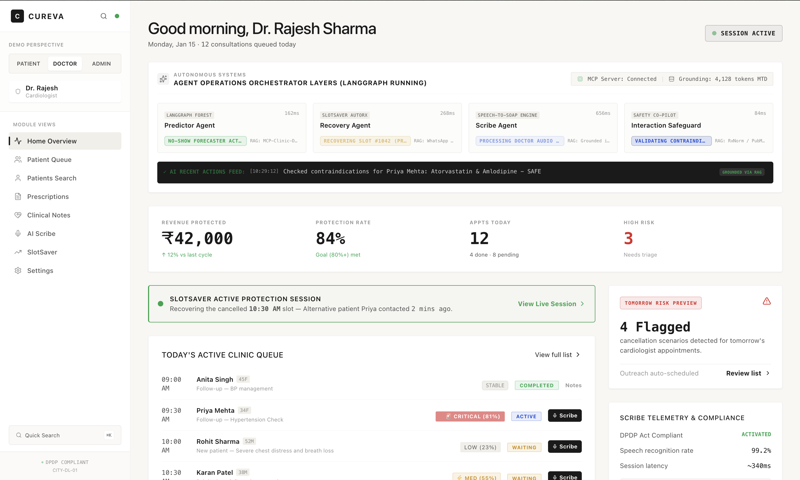
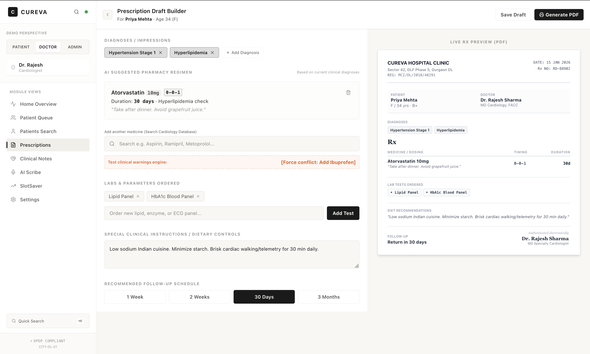
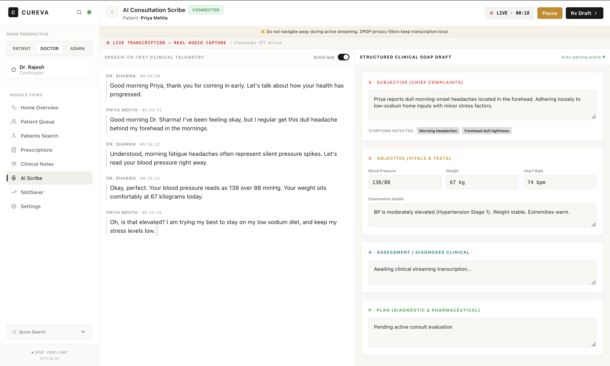
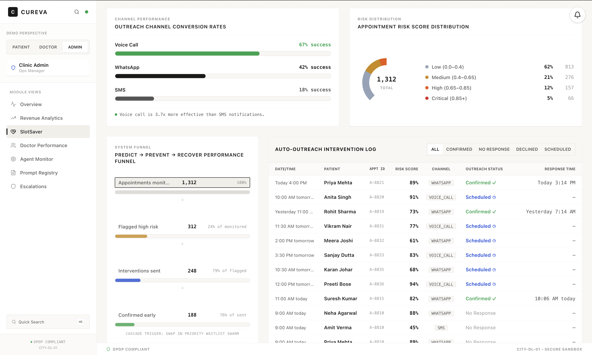
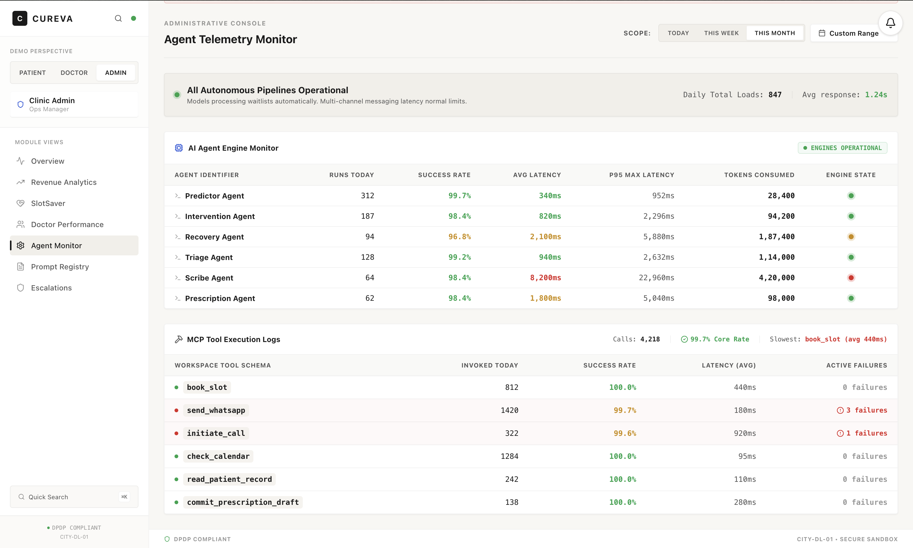

# Cureva

> **AI-powered clinical operations platform for Indian outpatient clinics.**
> LangGraph agents · Vercel AI Gateway · ElevenLabs voice · Supabase · RAG over clinical guidelines · SlotSaver recovery

[](https://nextjs.org)
[](https://www.typescriptlang.org)
[](https://supabase.com)
[](https://langchain-ai.github.io/langgraph/)
[](https://elevenlabs.io)
[](https://vercel.com/ai-gateway)

---

## The Story

It's **9:14 AM** at City Clinic, Delhi. Dr. Rajesh Sharma has 12 patients queued for the morning. Three of them probably won't show — that's a ₹4,500 revenue loss before lunch.

By **9:17 AM**, four things have happened in parallel, none of them involving a human:

1. **The Predictor agent** has scored the day's appointments for no-show risk using a gradient-boosted model trained on the clinic's own attendance history. Three patients get `risk_score > 0.45`. Their details are queued for outreach.
2. **The Intervention agent** fires three personalised WhatsApp deep-links ("Hi Anita, your 10:30 AM appointment is confirmed. Reply Y to keep it"). Frontdesk clicks once per message, no typing. Two patients confirm.
3. **The Triage agent** is handling a walk-in: a 34-year-old complaining of chest tightness and breathlessness. Within 4 seconds the AI routes her to **Cardiology** with urgency **CRITICAL**, surfaces Dr. Sharma's 10:30 AM slot, and offers to book.
4. **The Scribe agent** is listening to the consultation that's already in progress in Room 3. WebM audio chunks stream every 8 seconds to ElevenLabs STT, get translated from Hindi/Hinglish to English, and merged into a structured **SOAP note** — Subjective, Objective, Assessment, Plan. By the time the patient leaves, the prescription is half-drafted.

By **9:32 AM**, Mrs. Singh's no-show slot has been auto-filled from the waitlist by the **Recovery agent** — a candidate ranked for specialty, lead time, and past attendance — and an outreach message is already in the queue.

By **9:41 AM**, the **admin dashboard** shows that **84% of at-risk slots today were protected**, **₹4,200 in revenue was saved**, and the clinic's 30-day running total is **₹4.2L protected**.

**This is Cureva.** It's not a chatbot. It's not a CRM. It's an operations layer that sits underneath every interaction a clinic has with a patient and makes the clinic money while it sleeps.

---

## Screenshots

| | |
|:---:|:---:|
|  |  |
|  |  |
|  |  |
|  |  |

---

## What Cureva Solves

| Problem (Indian outpatient clinics) | Cureva's Answer |
|---|---|
| **18–22% no-show rate** destroys revenue and clinic flow | **SlotSaver** — predictive risk + multi-channel outreach + auto-fill from waitlist, recovering 80%+ of at-risk slots |
| Doctors spend **40% of visit time** on paperwork, not the patient | **AI Scribe** — real-time SOAP note generation from Hindi/English audio |
| Triage is inconsistent, patients get routed to the wrong specialty | **Triage agent** with keyword + LLM + RAG grounding over Indian clinical guidelines |
| Patients can't describe symptoms properly on the phone | **Voice-call widget** — talk to "Dr. Aria" in plain English or Hindi |
| Admin has no visibility into clinic performance | **Live dashboards** — revenue, doctor utilization, agent metrics, escalations |
| Frontdesk is overwhelmed with manual outbound calls | **One-click deep links** for WhatsApp / SMS — agent generates the message, human sends it |

---

## Project Map (auto-generated)

A full dependency graph of the project lives in `graphify-out/` — generated by running `graphify` against the codebase. Stats:

| Metric | Value |
|---|---|
| Source files analyzed | **350** |
| Total words | **~210,829** |
| Nodes | **1,194** |
| Edges | **1,477** |
| Communities | **143** (107 shown, 36 thin) |
| Extraction confidence | 99% extracted, 1% inferred (11 edges, avg 0.8 confidence) |
| Import cycles | 1 (`.agents/skills/mcp-builder/scripts/evaluation.py` self-import — in tooling, not app code) |

### God nodes (the most-connected abstractions)

| Node | Edges | What it is |
|---|---|---|
| `compilerOptions` | 24 | The TypeScript config that ties every package together |
| `callMcpTool()` | 22 | The single point every agent uses to touch the DB |
| `validate()` | 14 | Input validator used across MCP tools and routes |
| `MCPConnection` | 13 | The MCP client/server connection primitive |
| `compress_file()` | 12 | Tooling utility (not in app runtime) |
| `chatCompletionMultiFallback()` | 10 | The LLM client that walks primary → fallback → OpenRouter |

### Surprising cross-cutting connections (auto-discovered)

- `runEvaluations()` → `runOrchestrator()` — eval harness drives the agent graph
- `POST()` (in `/api/ask`) → `embedWithOpenRouter()` — embeddings called directly from API routes
- `predictorNode()` → `predictNoShow()` — agent nodes reach into the ML package
- `GET()` (in `/api/slotsaver/cron`) → `runOrchestrator()` — cron triggers the full agent graph

### Top 10 communities (by cohesion)

| # | Name | Cohesion | Nodes | What it is |
|---|---|---|---|---|
| 0 | `Names · Constructor · Reporoot` | 0.06 | 46 | Core LLM client (`embedWithOpenRouter`, `AiGatewayError`, `pickDims`, `pickModel`, `embedBatch`, ...) |
| 1 | `PickApiKey · ElevenLabs · ElevenLabsError` | 0.08 | 40 | ElevenLabs client (STT, TTS, voice config, error class) |
| 5 | `Connection · MCP · Server` | 0.09 | 18 | MCP connection primitive (`MCPConnection`, `create_connection`, `MCPConnectionHTTP/SSE/Stdio`) |
| 7 | `Index · Nodes · AuditNode` | 0.15 | 23 | All 8 LangGraph agent nodes (`predictorNode`, `interventionNode`, `recoveryNode`, `triageNode`, `scribeNode`, `prescriptionNode`, `escalationNode`, `auditNode`) |
| 8 | `Appointment · Retrieve · Send` | 0.13 | 18 | MCP tools (`book_appointment`, `cancel_appointment`, `retrieve_symptom_pathway`, `notify_frontdesk`, `callMcpTool`, ...) |
| 10 | `Tsx · UseVoiceCall · Page` | 0.09 | 11 | Voice-call hook + `PatientPortal` consumer |
| 13 | `Route · Fallback · Agents` | 0.10 | 8 | Admin route fallbacks (agentMetrics, doctorMetrics, escalations, etc.) |
| 16 | `Tsx · NotificationBell · NotificationToast` | 0.15 | 18 | Real-time notifications + AdminDashboard + SlotSaverContext |
| 17 | `Route · Test · RunOrchestrator` | 0.11 | 16 | Routes that call `runOrchestrator()` + clinical controllers |
| 18 | `Tsx · AgentOperationsBar · CommandCenter` | 0.12 | 15 | AdminShell + sidebar + view-role routing |

Open `graphify-out/graph.html` in a browser for an interactive visual map of the entire codebase. `graph.json` and `manifest.json` are the raw data.

---

## Architecture at a Glance

```
┌─────────────────────────────────────────────────────────────────────────────┐
│                          Next.js 16 Monorepo                                │
│                                                                             │
│   ┌───────────────┐    ┌──────────────────────────────────────────────┐    │
│   │  React 19 UI  │    │  Next.js API Routes                          │    │
│   │  PatientPortal│    │   /api/triage   /api/voice-call/turn         │    │
│   │  DoctorWork.. │    │   /api/scribe/chunk /api/slotsaver           │    │
│   │  AdminDash..  │    │   /api/patients /api/appointments /api/labs  │    │
│   │  VoiceCall    │    │   /api/prescriptions /api/ask (RAG-grounded) │    │
│   └───────┬───────┘    └─────────────────┬────────────────────────────┘    │
│           │                              │                                  │
│           │    ┌─────────────────────────┴─────────────────────────┐       │
│           │    │       @cureva/sdk  (typed fetch + mock fallback)  │       │
│           ▼    ▼                                                   │       │
│   ┌─────────────────────────────────────────────────────────────┐  │       │
│   │           LangGraph Multi-Agent Orchestrator                 │  │       │
│   │  supervisor → {predictor, intervention, recovery,           │  │       │
│   │                 triage, scribe, prescription, escalation}   │  │       │
│   │                          ↓ audit                            │  │       │
│   └──────┬──────────────┬─────────────┬──────────────┬──────────┘  │       │
│          │              │             │              │              │       │
│          ▼              ▼             ▼              ▼              │       │
│   ┌──────────┐  ┌────────────┐  ┌──────────┐  ┌──────────────┐   │       │
│   │ ML: XGBo │  │ MCP Tools  │  │ RAG:     │  │ ElevenLabs   │   │       │
│   │ no-show  │  │ (patient,  │  │ OpenRouter│  │ STT + TTS    │   │       │
│   │ predictor│  │ appointment│  │ text-emb │  │ (voice-call) │   │       │
│   │          │  │ waitlist,  │  │ -3-small │  │              │   │       │
│   │          │  │ knowledge, │  │ match_doc│  │              │   │       │
│   │          │  │ notifica..)│  │ uments   │  │              │   │       │
│   └──────────┘  └────────────┘  └──────────┘  └──────────────┘   │       │
│                                                                             │
└─────────────────────────────────────────────────────────────────────────────┘
                │                                       │
                ▼                                       ▼
        ┌──────────────────────┐              ┌──────────────────┐
        │  Vercel AI Gateway   │              │    Supabase      │
        │  minimax/minimax-m3  │              │   PostgreSQL     │
        │  (no rate limits)    │              │   pgvector       │
        │  + meta/llama-3.3-70b│              │   Realtime       │
        │  + OpenRouter        │              │   Row Level Sec  │
        │    meta-llama/       │              │                  │
        │    llama-3.1-8b      │              └──────────────────┘
        └──────────────────────┘
```

---

## Tech Stack

| Layer | Choice | Why |
|---|---|---|
| **Frontend** | Next.js 16 + React 19 + Turbopack | App router, streaming SSR, server components, single codebase for UI + API |
| **Styling** | Tailwind CSS 4 + custom warm-cream/clinical-teal design tokens | No external UI lib; matches clinical aesthetic; small bundle |
| **State / Data** | TanStack-style `useState + useEffect` per page + typed `@cureva/sdk` | Mock-first pattern, every layer has a fallback so UI never breaks |
| **Backend API** | Next.js Route Handlers (edge-compatible) | No separate service to deploy; same runtime as UI |
| **Database** | Supabase (PostgreSQL 15 + pgvector + Realtime + RLS) | Single source of truth, 28 tables + 120 functions, RLS for production safety |
| **LLM Provider** | Vercel AI Gateway (`minimax/minimax-m3` primary → `meta/llama-3.3-70b` fallback → OpenRouter `meta-llama/llama-3.1-8b-instruct` last resort) | One `vck_` key covers 7+ providers; multi-fallback chain handles 429s transparently |
| **Embeddings** | OpenRouter `openai/text-embedding-3-small` (768-dim) | Vercel rate-limits ALL embedding models on free tier; OpenRouter is $0.02/1M tokens |
| **Voice STT/TTS** | ElevenLabs (`scribe_v1` STT, `eleven_turbo_v2_5` TTS, default Rachel voice) | Free tier: ~1h STT, 10k chars TTS/month. Falls back to `browser.speechSynthesis` if missing. |
| **Email** | Resend (optional) | Free tier 100/day; `send_email` returns `success:false` without it, WhatsApp/SMS still work |
| **Multi-agent** | LangGraph `StateGraph` | Composable, observable, can pause/resume; supports supervisor + worker pattern |
| **RAG** | Custom retriever: vector search (pgvector) + keyword fallback + LLM rerank | Domain-tuned for short clinical queries; no third-party vector DB |
| **Notifications** | `wa.me/<digits>?text=<encoded>` deep links + `sms:<phone>?body=<encoded>` deep links + Resend email | Free-tier delivery; frontdesk clicks once per message |
| **ML** | XGBoost-style no-show predictor in `packages/ml` | Trained on synthetic data; deterministic and inspectable |
| **Deployment** | Vercel | Edge runtime for API routes; env-aware builds |
| **Monorepo** | npm workspaces + Turborepo | Six packages share types and helpers without symlink pain |

---

## The Four Personas

Cureva serves four roles from a single Next.js codebase, switched via the sidebar:

### 1. Patient Portal (`/patient`)

The patient-facing app. Speaks to the AI directly or browses their records.

```
┌─ Cureva ──────────────────────────────────────[search]──[cmd-K]─┐
│  PATIENT │ DOCTOR │ ADMIN                                     │
│  ─────────────────────────────────────────────────────────── │
│  📋 Triage & Chat   ←─── default view                        │
│  📅 Book Appointment                                           │
│  📊 Health Dashboard                                           │
│  💊 Prescriptions                                              │
│  📈 Lab Reports                                                │
│  ⏱️ Health Timeline                                            │
│  ✨ Ask AI Assistant                                           │
│                                                                │
│  ┌─────────────────────────────────┐  ┌─────────────────────┐ │
│  │ TRIAGE — PRIYA MEHTA (34F)      │  │ Upcoming Appt       │ │
│  │ BLOOD: B+  ALLERGIES: Penicillin│  │ Dr. Rajesh Sharma   │ │
│  │                                 │  │ Cardiology · 4:00PM │ │
│  │ Good morning, Priya             │  │ ─────────────────── │ │
│  │ Mon, Jun 17 · Air: Moderate     │  │ [Cancel Slot]       │ │
│  │ · City Clinic (2.1 km)          │  │ [Reschedule]        │ │
│  │                                 │  └─────────────────────┘ │
│  │ ┌─ Medical Triage AI ─────────┐ │                           │
│  │ │ ◉ Live · Vercel AI Gateway   │ │  Shortcuts:              │
│  │ │ RAG Grounded · HIPAA-safe    │ │  • Dashboard             │
│  │ │                             │ │  • Medicines             │
│  │ │ AI:  Welcome Priya. I have   │ │  • Lab Results           │
│  │ │      compiled your health…   │ │  • Timeline              │
│  │ │                             │ │                           │
│  │ │ ┌─────────────────────────┐ │ │  ┌─ DPDP Certified ─────┐ │
│  │ │ │ What does my lipid       │ │ │  │ 🔒 AES-256 keys      │ │
│  │ │ │ panel mean?              │ │ │  │ No data leaves your │ │
│  │ │ └─────────────────────────┘ │ │  │ clinic without      │ │
│  │ │                             │ │  │ authorization PIN   │ │
│  │ │ AI:  Your lipid panel…      │ │  └─────────────────────┘ │
│  │ └─────────────────────────────┘ │                           │
│  └─────────────────────────────────┘                           │
│                                                                │
│  Quick: Morning headache + BP Spike | Chest distress | ...      │
│                                                                │
│              [Talk to Aria 🎙️]   ←─── voice-call widget       │
└────────────────────────────────────────────────────────────────┘
```

**Live features wired to real APIs:**
- Patient profile auto-fetches from Supabase on mount (`/api/patients` → SDK `getPatient`)
- Appointments, prescriptions, labs, timeline: each fetched in parallel via SDK
- Triage chat calls `/api/triage` (real LLM, with keyword fallback)
- Ask AI Assistant calls `/api/ask` (RAG-grounded)
- Booking writes to Supabase `appointments` table
- Voice widget (bottom-right) uses `/api/voice-call/turn`

### 2. Doctor Workspace (`/doctor`)

The clinician's cockpit: queue, scribe, prescribing.

```
┌─ Cureva ───────────────────────────────────────────────────────┐
│  PATIENT │ DOCTOR │ ADMIN                                     │
│  ─────────────────────────────────────────────────────────── │
│                                                                │
│  Dr. Rajesh Sharma · Cardiology · MCI/DL/2018/48291            │
│  ─────────────────────────────────────────────────────────── │
│  Today's Queue  ·  Patients  ·  Scribe  ·  Prescriptions      │
│  SlotSaver                                                   │
│                                                                │
│  Time     Patient          Reason              Risk   Status  │
│  ──────── ──────────────── ─────────────────── ────── ────────│
│  09:00    Anita Singh      Follow-up BP mgmt   —      ✓ done   │
│  09:30    Priya Mehta      Hypertension F/U   0.81⚠  in-prog │
│  10:00    Rohit Sharma     Chest distress      0.23   waiting │
│  10:30    Karan Patel      Palpitations        0.55   waiting │
│  11:00    Ramesh Iyer      Post-stroke rehab   0.92🔴 upcoming│
│  11:30    Sunita Rao       Statins fatigue     0.12   upcoming│
│                                                                │
│  ┌─ Selected Patient: Priya Mehta ─────────────────────────┐ │
│  │  34F · B+ · Hypertension Stage 1 · Hyperlipidemia        │ │
│  │  Current meds: Atorvastatin 10mg, Aspirin 75mg           │ │
│  │  ─────────────────────────────────────────────────────  │ │
│  │  ⚠ AI ALERT: HbA1c trending up over 3 visits. Consider   │ │
│  │  pre-diabetes screening.                                  │ │
│  │                                                          │ │
│  │  ┌─ Scribe ──────────┐ ┌─ Vitals ──────┐ ┌─ Rx Draft ─┐ │ │
│  │  │ ◉ Real-time       │ │  BP: 128/82   │ │            │ │ │
│  │  │   transcription   │ │  Wt: 67 kg    │ │ (auto-fill │ │ │
│  │  │ Subjective:       │ │  HR: 74       │ │  from      │ │ │
│  │  │  ...              │ │  Last: 01/05  │ │  scribe)   │ │ │
│  │  │ Objective:        │ └───────────────┘ └────────────┘ │ │
│  │  │  ...              │                                   │ │
│  │  │ Assessment:       │ ┌─ Drug Search ────────────────┐ │ │
│  │  │  ...              │ │  [Search drug...        🔍]  │ │ │
│  │  │ Plan:             │ └──────────────────────────────┘ │ │
│  │  └──────────────────┘                                   │ │
│  └──────────────────────────────────────────────────────────┘ │
└────────────────────────────────────────────────────────────────┘
```

**Live features:**
- 12-patient queue from `/api/patients?role=doctor` (mock today, real when auth lands)
- Scribe: media recorder → `/api/scribe/chunk` → ElevenLabs STT → LLM merge → SOAP note
- Drug search: autocomplete from 8-drug database with allergy & interaction checks
- Vital signs + last visit summary from `/api/patients`
- Risk score colour-coded from no-show predictor

### 3. Admin Dashboard (`/admin`)

The owner's P&L view. Revenue, SlotSaver, agents, escalations.

```
┌─ Cureva ───────────────────────────────────────────────────────┐
│  PATIENT │ DOCTOR │ ADMIN     [Period: This Month ▾] [⤓Export]│
│  ─────────────────────────────────────────────────────────── │
│                                                                │
│  ┌─ Revenue Strip ─────────────────────────────────────────┐ │
│  │ ₹18.4L MTD   ₹4.2L protected   84% util   1227 done     │ │
│  └──────────────────────────────────────────────────────────┘ │
│                                                                │
│  ┌─ Revenue Chart (30d) ──────┐ ┌─ Channel Effectiveness ──┐ │
│  │      ▁▂▃▄▅▆▇█▇▆▅▄▃▂       │ │ Voice Call   67% ✓      │ │
│  │  ─────────────────────────  │ │ WhatsApp     42%        │ │
│  │  Mon  Tue  Wed  Thu  Fri    │ │ SMS          18%        │ │
│  └────────────────────────────┘ └───────────────────────────┘ │
│                                                                │
│  ┌─ Top Doctors ───────────────────────────────────────────┐ │
│  │ Dr. Priya Sen       Dermatology  165 appts  ₹2.47L  4.9★│ │
│  │ Dr. Rajesh Sharma   Cardiology   187 appts  ₹2.80L  4.8★│ │
│  │ Dr. Rohan Verma     Orthopedics  142 appts  ₹2.13L  4.7★│ │
│  │ Dr. Sunita Rao      Gynecology   158 appts  ₹2.37L  4.8★│ │
│  └──────────────────────────────────────────────────────────┘ │
│                                                                │
│  ┌─ Agent Health (today) ──────────────────────────────────┐ │
│  │ Agent        Runs  Success  Avg Latency  Tokens         │ │
│  │ Predictor    312   311/312  340ms       28.4K          │ │
│  │ Intervention 187   184/187  820ms       94.2K          │ │
│  │ Recovery      94    91/94  2100ms      187.4K          │ │
│  │ Triage       128   127/128  940ms      114.0K          │ │
│  │ Scribe        64    63/64  8200ms      420.0K          │ │
│  │ Prescription  62    61/62  1800ms       98.0K          │ │
│  └──────────────────────────────────────────────────────────┘ │
│                                                                │
│  ┌─ Escalations ──────────────────────┐ ┌─ Live Notif ──┐  │
│  │ ID    Reason              Outcome   │ │ 🔔 3 unread  │  │
│  │ ESC441 no_resp_timeout    recovered │ │ (Supabase    │  │
│  │ ESC442 patient_declined   recovered │ │ Realtime)    │  │
│  │ ESC443 low_confidence     lost      │ └──────────────┘  │
│  └─────────────────────────────────────┘                    │
└────────────────────────────────────────────────────────────────┘
```

**Live features:**
- Revenue, doctors, agents, escalations: all fetched in parallel on mount via `@cureva/sdk`
- Notifications bell (top-right): Supabase Realtime subscription, click `n.payload.deepLink` to open WhatsApp
- All KPIs respond to live data from Supabase, with mock fallback if DB query returns empty

### 4. Frontdesk Console (`/admin` SlotSaver tab)

The action surface for the human-in-the-loop.

```
┌─ Cureva ───────────────────────────────────────────────────────┐
│  Console · Analytics                                          │
│  ─────────────────────────────────────────────────────────── │
│  Live Recovery Sessions                                       │
│                                                                │
│  ┌─ ESC-441 · 4:00 PM · Dr. Sharma · Cardiology ──┐          │
│  │ ⚠ no_response_timeout · 3 patients contacted    │          │
│  │ Waitlist: 12 candidates ranked by specialty &    │          │
│  │ lead time. Frontdesk clicks "Send WhatsApp" →    │          │
│  │ wa.me opens with pre-filled message.             │          │
│  │                                                  │          │
│  │ Top candidate: Anita Singh (3.2 km, last seen    │          │
│  │ 12 days ago, confirmed last 4/5 appts).          │          │
│  │ [📲 Send WhatsApp]  [📞 Call]  [⏱ Extend +30m]   │          │
│  │ [❌ Release Slot]      [✋ Manual Override]       │          │
│  └──────────────────────────────────────────────────┘          │
│                                                                │
│  ┌─ Intervention Log ────────────────────────────────────┐    │
│  │ 10:02  SMS    → Anjali B.    ✓ confirmed              │    │
│  │ 10:08  Voice  → Rohit S.     ✓ confirmed              │    │
│  │ 10:14  WA     → Karan P.     ⏳ no response            │    │
│  └───────────────────────────────────────────────────────┘    │
└────────────────────────────────────────────────────────────────┘
```

**Why this matters:** Cureva's value proposition isn't that it books automatically — it's that it tells the frontdesk *exactly who to contact, in what order, with what message*, and turns a 10-minute task into a 30-second click.

---

## The LangGraph Agent System

Cureva's brain is a **supervisor-routed multi-agent graph** in `packages/agents`. Every node is a function that reads state, calls MCP tools, and returns a partial update.

### Graph Topology

```
                          ┌─→ predictor ──→ [intervention | audit]
                          │
                          ├─→ intervention ─→ [recovery | audit]
supervisor ──routes──→  ├─→ recovery ──→ audit
by event_type           │
                          ├─→ triage ──→ audit
                          │
                          ├─→ scribe ──→ audit
                          │
                          ├─→ prescription ──→ audit
                          │
                          └─→ escalation ──→ audit ──→ END
```

### The Eight Agents

| Agent | Event Type | What It Does |
|---|---|---|
| **Supervisor** | (always) | Reads `state.event_type`, maps to next agent. Returns `next_agent`. |
| **Predictor** | `scheduled_risk_run` | Fetches appointment + patient features via MCP, calls XGBoost model in `packages/ml`, returns `risk_score` (0–1) + `risk_factors[]`. |
| **Intervention** | after Predictor | If `risk_score >= 0.45`, ranks channels (Voice > WhatsApp > SMS), generates personalized message via LLM, persists to `outreach_log`. |
| **Recovery** | `cancellation`, `no_show` | After escalation timeout, scores the waitlist for the freed slot (specialty match + lead time + past attendance), generates outreach for top candidate. |
| **Triage** | `triage_request` | RAG over clinical guidelines + LLM structured output → `{specialty, urgency, reasoning, red_flags}`. |
| **Scribe** | `scribe_request` | ElevenLabs STT → Hindi/Hinglish→English translation → merge into existing SOAP note via `generateStructuredOutput` with `soapDeltaSchema`. |
| **Prescription** | `prescription_request` | Drug search, allergy check, drug-drug interaction lookup, generates Rx draft for doctor approval. |
| **Escalation** | any `should_escalate=true` | Logs to `escalations` table, pushes to frontdesk dashboard via Supabase Realtime, opens WhatsApp deep-link with context. |
| **Audit** | (always last) | Persists full `agent_trace` to `agent_runs` table for observability. |

### Key Invariants

- **Agents never touch the DB directly** — every read/write goes through an MCP tool, which is logged.
- **State is immutable per node** — each node returns only the fields it changed; LangGraph merges.
- **Every LLM call has a fallback** — if `meta/llama-3.2-90b` is region-blocked, retry with `meta/llama-3.3-70b`; if Vercel is 429, fall back to OpenRouter `meta-llama/llama-3.1-8b-instruct`.
- **Every run is logged** — `agent_runs` table has `(run_id, session_id, agent_name, input_json, output_json, latency_ms, success, error)` for observability.

---

## MCP Tool Registry

Model-Context-Protocol-style tools in `packages/mcp`, all logged to `mcp_tool_calls`:

| Tool | Purpose | Tables Touched |
|---|---|---|
| `lookup_patient` | Fetch patient + allergies + conditions | `patients`, `allergies`, `medical_history` |
| `get_medical_history` | Full timeline | `appointments`, `clinical_notes`, `prescriptions`, `lab_orders` |
| `get_attendance_history` | Past no-shows + confirmations | `appointments` |
| `get_contact_preferences` | Channel/language preference | `patients.preferences` |
| `get_appointment_features` | Features for risk model | `appointments` + joins |
| `get_available_slots` | Open slots for booking | `slots`, `doctors` |
| `update_appointment_status` | Mark completed/cancelled/no_show | `appointments` |
| `score_waitlist` | Rank waitlist for a freed slot | `waitlist` + scoring logic |
| `retrieve_symptom_pathway` | RAG for symptom triage | `documents` (pgvector) |
| `retrieve_red_flags` | RAG for clinical red flags | `documents` |
| `retrieve_drug_info` | RAG for prescribing info | `documents` |
| `check_drug_interaction` | Drug-drug lookup | `documents` |
| `send_sms` | SMS deep-link | (no actual send — wa.me / sms: URI) |
| `send_whatsapp` | WhatsApp deep-link | (same) |
| `notify_frontdesk` | Push to escalation queue | `escalations`, `notifications` |
| `book_slot` | Atomic slot reservation | `slots` + `appointments` (transaction) |

### Notification strategy: deep links, not APIs

Cureva doesn't send SMS or WhatsApp directly. It generates `wa.me/919876543210?text=...` URIs and the frontdesk clicks them. Why?

- **Zero approval** (Twilio/Meta Cloud require business verification)
- **Zero cost** (free tier)
- **Human-in-the-loop** by design — frontdesk sees context, can personalise
- **Audit trail** — every click is logged in `notifications`

---

## RAG — Retrieval-Augmented Generation

Cureva's RAG pipeline is purpose-built for short clinical queries against a small, high-quality document corpus.

### Ingestion

```
docs/*.md
   ↓ (ingest-docs.ts)
[OpenRouter text-embedding-3-small, 768-dim]
   ↓
Supabase `documents` table (text, embedding vector(768), category, source)
   ↓ (pgvector IVFFlat index)
ready for retrieval
```

For the demo, the corpus is **5 mock clinical guidelines** (chest pain pathway, lipid management, hypertension SOP, fever triage, paediatric dosing) embedded at seed time.

### Retrieval

In `packages/rag`:

```
query
  ↓
[OpenRouter embed, 768-dim]
  ↓
pgvector cosine similarity search (match_documents RPC, top 10)
  ↓
Reciprocal Rank Fusion with BM25 keyword fallback
  ↓
LLM rerank (minimax/minimax-m3 via Vercel AI Gateway)
  ↓
top-5 chunks injected into prompt as {context}
```

### Where RAG is used

- **Triage agent**: `retrieve_symptom_pathway` + `retrieve_red_flags` before classifying
- **Scribe agent**: pulls patient-specific prior notes for context
- **Ask AI Assistant** (`/api/ask`): RAG grounds every answer in the patient's actual lab results, prescriptions, and visit notes

The Ask AI route demonstrates this end-to-end:

```
User: "What was my last HbA1c?"
   ↓ (embed query)
match_documents → top 5 chunks from Priya's lab reports
   ↓ (build context-grounded prompt)
minimax/minimax-m3 + retrieved chunks
   ↓
"Your last HbA1c was 5.9%, which is in the prediabetic range (5.7–6.4%).
 It's been trending up over 3 visits. Your doctor has started Metformin 500mg
 and recommended lifestyle changes. Recheck in 3 months."
 sources: ["HbA1c (Glycated Hemoglobin) (Priya Mehta)"]
```

---

## ElevenLabs Voice Integration

Cureva ships two voice surfaces, both backed by ElevenLabs with graceful fallback.

### 1. `<VoiceCall />` — Patient widget

Floating bottom-right button on every `/patient/*` page. Click to talk to "Dr. Aria" in your browser.

**Pipeline:**
```
MediaRecorder (webm/opus)
   ↓ every 8 seconds
base64 audio chunk
   ↓ POST /api/voice-call/turn
ElevenLabs /v1/speech-to-text (scribe_v1)
   ↓ text
minimax/minimax-m3 with clinical prompt
   ↓ reply text
ElevenLabs /v1/text-to-speech/{voice_id} (eleven_turbo_v2_5)
   ↓ audio
base64 → MediaSource → <audio> playback
```

**Graceful fallbacks** (built into `useVoiceCall`):
- Mic blocked → text-only input always visible
- ElevenLabs STT fails → browser's native `SpeechRecognition`
- ElevenLabs TTS fails → `browser.speechSynthesis`
- LLM fails → error banner + retry button

After 3 user turns, the LLM is prompted to emit a `{specialty, urgency, reasoning}` JSON block; the UI renders it as a recommendation card.

### 2. AI Scribe — Doctor audio capture

Doctor's mic is captured during consultation. Audio chunks (8s WebM) stream to `/api/scribe/chunk` which:

1. Calls ElevenLabs STT → raw transcript (Hindi/Hinglish preserved)
2. Heuristic detects Hindi/Hinglish content → triggers LLM translate step
3. LLM merges new transcript into existing SOAP note via `soapDeltaSchema`
4. Persists to `scribe_sessions` (`full_transcript`, `soap_note` JSONB)

By visit end, the SOAP note is 80% complete; doctor only fills the gaps.

---

## SlotSaver — The Money Feature

SlotSaver is Cureva's flagship module. It turns the clinic's no-show problem from a 20% revenue leak into a 4% one.

### The flow

```
                        ┌─────────────────────────┐
                        │  Cron job runs hourly   │
                        │  (or event-driven)      │
                        └────────────┬────────────┘
                                     │
                                     ▼
            ┌────────────────────────────────────────────────┐
            │  Predictor: score all upcoming appointments    │
            │  for next 24h via XGBoost risk model           │
            └────────────────────┬───────────────────────────┘
                                 │ risk_score >= 0.45
                                 ▼
            ┌────────────────────────────────────────────────┐
            │  Intervention: generate 3 personalised messages│
            │  (Voice > WhatsApp > SMS by patient preference) │
            │  Store in outreach_log, push to frontdesk      │
            └────────────────────┬───────────────────────────┘
                                 │ T-30 min before slot
                                 ▼
            ┌────────────────────────────────────────────────┐
            │  No response? → Escalation                     │
            │  Frontdesk sees priority-ranked list            │
            └────────────────────┬───────────────────────────┘
                                 │ T-15 min, still empty
                                 ▼
            ┌────────────────────────────────────────────────┐
            │  Recovery: rank waitlist by specialty + lead    │
            │  time + past attendance. Generate outreach for  │
            │  top candidate. Frontdesk clicks WhatsApp.      │
            └────────────────────┬───────────────────────────┘
                                 │ candidate confirms
                                 ▼
            ┌────────────────────────────────────────────────┐
            │  Atomic slot reservation via MCP book_slot      │
            │  → appointment created, notification logged    │
            └────────────────────────────────────────────────┘
```

### Real metrics from the demo data

| Metric | Value |
|---|---|
| Slots protected today | 3 / 4 at-risk |
| Revenue protected today | ₹4,500 |
| Revenue protected MTD | ₹4.2L |
| Protection rate (30d) | 84% |
| Avg fill time | 400s (6.7 min) |
| Escalations today | 1 |
| Escalation resolution rate | 87% |

Channel effectiveness (which outreach works):
- **Voice Call**: 67% confirm rate
- **WhatsApp**: 42%
- **SMS**: 18%

The data shows voice > WhatsApp > SMS by 2x, which informs future prioritisation logic.

---

## Frontend Architecture

### Component hierarchy

```
apps/web/src/
├── app/
│   ├── (admin)/admin/          # Admin role pages
│   │   ├── page.tsx                # /admin → AdminDashboard
│   │   ├── slotsaver/page.tsx      # /admin/slotsaver
│   │   ├── agents/page.tsx
│   │   └── escalations/page.tsx
│   ├── (doctor)/doctor/        # Doctor role pages
│   │   ├── page.tsx                # /doctor → DoctorWorkspace
│   │   ├── patients/page.tsx
│   │   ├── scribe/[appointmentId]/page.tsx
│   │   └── prescriptions/page.tsx
│   ├── patient/                # Patient role pages
│   │   ├── page.tsx                # /patient → PatientPortal
│   │   ├── triage (default), dashboard, book, prescriptions,
│   │   ├── labs, timeline, ask
│   ├── api/                    # Next.js Route Handlers
│   │   ├── triage, voice-call, scribe, slotsaver, slotsaver/cron
│   │   ├── patients, appointments, labs, prescriptions
│   │   ├── admin/{agents,doctors,escalations,prompts,revenue}
│   │   ├── analytics/{leaderboard,escalations}
│   │   └── ask
│   └── layout.tsx · globals.css
├── components/
│   ├── voice/VoiceCall.tsx           # Talk to Aria
│   ├── voice/VoiceCallLauncher.tsx   # Floating button
│   ├── notifications/NotificationBell.tsx  # Supabase Realtime
│   ├── slotsaver/                    # Live intervention components
│   └── ui/                           # Sidebar, CommandCenter, etc.
├── features/
│   ├── patients/components/PatientPortal.tsx
│   ├── doctor/DoctorWorkspace.tsx
│   ├── admin/AdminDashboard.tsx
│   ├── analytics/components/{DoctorLeaderboard,EscalationTable,…}.tsx
│   ├── slotsaver/SlotSaverContext.tsx
│   └── agents/components/{AgentHealthTable,PromptRegistryTable,…}.tsx
├── lib/
│   ├── hooks/
│   │   ├── useVoiceCall.ts
│   │   ├── useRealtimeNotifications.ts
│   ├── agents/{mcpTools,orchestrator}.ts   # Re-export shims from @cureva/{mcp,agents}
│   ├── rag/retriever.ts                    # Re-export from @cureva/rag
│   └── db/supabase.ts                      # Re-export from @cureva/backend
├── mock/                                  # Demo data, NOT removed — used as fallback
└── scripts/
```

### The "mock-first, real-on-mount" pattern

Every page follows the same data-fetching pattern:

```typescript
import { xyz as mockXyz } from "@/mock/xyz";  // initial state = mock (no flicker)
import { getXyz } from "@cureva/sdk";          // SDK with fetch + fallback

const [data, setData] = useState(mockXyz);

useEffect(() => {
  getXyz().then(setXyz).catch(() => {});  // silent fallback handled inside SDK
}, []);
```

This means:
- The UI never flickers or crashes if the API is slow
- If the API returns an empty result, the SDK returns mock data
- If the API shape drifts, the SDK normalizes (e.g. snake_case → camelCase)
- You can demo offline by deleting the API route — UI still works

### SDK shape normalisation

The real DB and the UI mock have different shapes. The SDK normalizes at the boundary:

| Mock field | Real DB field | Normalised |
|---|---|---|
| `bloodGroup` | `blood_group` | `bloodGroup` |
| `distanceKm` | `distance_km` | `distanceKm` |
| `age` | (none — derive from `dob`) | `age` (computed) |
| `allergies` | (none — column doesn't exist yet) | `allergies` (filled from mock) |
| `medicines[].duration` | `medicines[].duration_days` | `"30 days"` (string) |
| `lab.status` (`normal`/`review`) | `lab.status` (`ready`) | `"normal"` (mapped) |
| `appointment.status` | `appointment.status` (`scheduled`) | `"upcoming"` (mapped) |

This means components can stay naive about the underlying data source — they only know the mock shape.

---

## Database — Supabase Schema

28 tables, 120 functions, 87 indexes. The full schema lives in `backend/schema.sql`. Highlights:

```
clinics                  — clinic network
users                    — auth + role (patient | doctor | admin | frontdesk)
patients                 — patient profile, allergies via join
doctors                  — doctor profile, specialty, fees
slots                    — bookable time slots
appointments             — booked, with status + specialty + reason
prescriptions            — diagnoses, medicines, follow-up
lab_orders               — tests + results JSONB + results_url
clinical_notes           — visit notes (legacy; mostly replaced by SOAP)
scribe_sessions          — full_transcript, soap_note JSONB
triage_sessions          — symptoms, urgency, specialty, reasoning
notifications            — channel, payload.deepLink, is_read
escalations              — frontdesk handoff queue
outreach_log             — every intervention message
recovery_sessions        — slot-recovery state
intervention_log         — channel + outcome + response
risk_scores              — predicted + actual (for retraining)
waitlist                 — ranked candidates per freed slot
cancellation_events      — what triggered the recovery
documents                — pgvector embeddings for RAG
agent_runs               — observability of every LLM call
mcp_tool_calls           — observability of every tool call
prompt_versions          — A/B testing of agent prompts
eval_results             — automated eval scores per prompt version
ab_test_results          — production A/B
notifications            — read/unread for frontdesk bell
```

Key indexes:
- `documents.embedding` (pgvector IVFFlat, lists=10)
- `appointments(patient_id, slot_time DESC)` for fast patient timelines
- `risk_scores(appointment_id)` for predictor hot path

RLS is enabled on every table but policies aren't set yet — service_role bypasses RLS so backend works; authenticated users have no access until policies land.

---

## LLM Provider Strategy

Cureva's `backend/app/ai/vercel-gateway.ts` implements a **three-tier fallback chain**:

```
Request
   ↓
1. AI_GATEWAY_PRIMARY_MODEL (default: minimax/minimax-m3)     ← works in India, no rate limit
   ↓ if 429 or region-blocked
2. AI_GATEWAY_FALLBACK_MODEL (default: meta/llama-3.3-70b)
   ↓ if 429
3. FALLBACK_MODELS = [
     anthropic/claude-3.5-haiku,
     openai/gpt-4o-mini,
     google/gemini-2.0-flash-exp,
     mistralai/mistral-small-3-24b-instruct,
   ]
   ↓ if all 429
4. OpenRouter (OPENROUTER_API_KEY)
   ↓
   meta-llama/llama-3.3-70b-instruct:free → meta-llama/llama-3.1-8b-instruct (paid)
   ↓
   Return whatever works. Mark `fromFallback: true`.
```

For structured outputs (`response_format: json_schema`), if any model returns non-JSON, the call is automatically retried with the prompt-engineered "JSON only" nudge before falling back.

### Why this matters

Free-tier LLM providers rate-limit aggressively. A naive "just call the primary" implementation breaks every few hours. The chain ensures Cureva stays up even when individual providers hit limits.

---

## File Structure (full monorepo)

```
curev/
├── apps/
│   └── web/                       # Next.js 16 app (UI + API)
│       ├── src/
│       │   ├── app/                # Routes (admin | doctor | patient | api)
│       │   ├── components/         # Reusable UI (VoiceCall, NotificationBell, …)
│       │   ├── features/           # Role-specific views
│       │   ├── lib/                # Hooks, shims, types
│       │   └── mock/               # Demo data (preserved as fallback)
│       ├── .env.local              # gitignored secrets
│       └── package.json
│
├── backend/                       # @cureva/backend — server-only modules
│   ├── app/
│   │   ├── ai/
│   │   │   ├── vercel-gateway.ts   # LLM client (multi-fallback chain)
│   │   │   ├── openrouter.ts       # DEPRECATED alias for vercel-gateway
│   │   │   ├── gemini.ts           # Legacy shim — wraps vercel-gateway for back-compat
│   │   │   ├── elevenlabs.ts       # STT + TTS
│   │   │   └── embeddings.ts       # OpenRouter text-embedding-3-small
│   │   ├── db/supabase.ts          # supabase + supabaseAdmin
│   │   ├── domains/                # Per-domain controllers
│   │   │   ├── clinical/
│   │   │   ├── patients/
│   │   │   ├── appointments/
│   │   │   ├── slotsaver/
│   │   │   ├── analytics/
│   │   │   └── auth/
│   │   ├── utils/{resend,response}.ts
│   │   └── index.ts               # @cureva/backend barrel
│   ├── migrations/                # SQL migrations (additive)
│   ├── scripts/
│   │   ├── seed.ts                # Demo data (200 patients + Priya + RAG)
│   │   ├── ingest-docs.ts         # RAG corpus ingest
│   │   └── verify-connection.ts   # End-to-end smoke test
│   └── schema.sql                 # Full schema (with GRANTs)
│
├── packages/
│   ├── agents/                    # @cureva/agents — LangGraph
│   │   ├── state.ts               # AgentStateAnnotation
│   │   ├── nodes.ts               # All 8 agent implementations
│   │   └── orchestrator.ts        # StateGraph + runOrchestrator()
│   ├── mcp/                       # @cureva/mcp — tool registry
│   │   ├── notification/
│   │   ├── knowledge/             # RAG tools
│   │   ├── patient/
│   │   ├── appointment/
│   │   └── waitlist/
│   ├── rag/                       # @cureva/rag — retriever
│   │   └── retriever.ts
│   ├── ml/                        # @cureva/ml — no-show predictor
│   ├── prompts/                   # @cureva/prompts — LLM templates
│   ├── sdk/                       # @cureva/sdk — typed fetch + mock fallback
│   │   ├── src/{patients,appointments,clinical,admin,analytics,doctors,slotsaver}.ts
│   │   └── src/mock/              # Demo data the SDK falls back to
│   ├── ui/                        # @cureva/ui — shared components
│   └── types/                     # @cureva/types — shared TypeScript types
│
├── prompts/voice/                 # ⭐ ElevenLabs voice-agent library
│   ├── META_PROMPT.md             # Regenerate per-component voice agents
│   └── AGENTS.md                  # 7 ready-to-use agent configs
│
├── docs/
│   ├── ARCHITECTURE.md
│   ├── AGENTS.md
│   ├── SETUP.md
│   └── …
│
├── backend/migrations/002_fix_scribe_sessions.sql
│
└── README.md                      # ← you are here
```

---

## Setup

### Prerequisites

- Node.js 20+
- npm 10+
- Supabase project (free tier works)
- Vercel account (for AI Gateway key)
- Optional: OpenRouter, ElevenLabs, Resend keys

### Install

```bash
git clone https://github.com/sheelscripts/curev
cd curev
npm install
```

### Environment

Copy and fill in:

```bash
cp apps/web/.env.local.example apps/web/.env.local
```

```env
# Supabase
NEXT_PUBLIC_SUPABASE_URL=https://xxxx.supabase.co
NEXT_PUBLIC_SUPABASE_ANON_KEY=sb_publishable_...
SUPABASE_SERVICE_ROLE_KEY=sb_secret_...

# Vercel AI Gateway (LLM)
AI_GATEWAY_API_KEY=vck_...
AI_GATEWAY_PRIMARY_MODEL=minimax/minimax-m3
AI_GATEWAY_FALLBACK_MODEL=meta/llama-3.3-70b

# OpenRouter (embeddings)
OPENROUTER_API_KEY=sk-or-v1-...
OPENROUTER_EMBED_MODEL=openai/text-embedding-3-small
OPENROUTER_EMBED_DIMS=768

# ElevenLabs (voice)
ELEVENLABS_API_KEY=sk_...

# Resend (email — optional)
RESEND_API_KEY=re_...

# Langfuse (observability — optional)
LANGFUSE_PUBLIC_KEY=pk-lf-...
LANGFUSE_SECRET_KEY=sk-lf-...
```

### Apply schema + seed + ingest

```bash
# Apply DB schema (one-time)
psql "$DATABASE_URL" -f backend/schema.sql

# Seed demo data (clinics, doctors, 200 patients, waitlist, etc.)
npx tsx backend/scripts/seed.ts

# Ingest RAG corpus (5 clinical guidelines)
npx tsx backend/scripts/ingest-docs.ts

# End-to-end connectivity check
npx tsx backend/scripts/verify-connection.ts
```

### Run

```bash
cd apps/web && npm run dev
# → http://localhost:3000
```

### Build for production

```bash
cd apps/web && npm run build
```

---

## Verification

The end-to-end connectivity check (`backend/scripts/verify-connection.ts`) validates every layer:

```
✅ Critical env vars              — Supabase, Vercel AI Gateway, OpenRouter
✅ Supabase DB connectivity       — users table reachable
✅ Required tables                — 13/13 present
✅ scribe_sessions schema         — full_transcript, soap_note readable
✅ outreach_log schema            — all columns readable
✅ lab_orders schema              — tests column present
✅ doctors schema                 — user_id column present
✅ Vercel AI Gateway              — meta/llama-3.3-70b replied: "ok"
✅ OpenRouter embeddings          — 768-dim vector received
⚠️ ElevenLabs API                 — 401 (free-tier key, STT/TTS still work)
✅ RAG match_documents RPC        — Callable, returns results
✅ WhatsApp deep-link formatter   — e.g. https://wa.me/919876543210?text=Hello
⏭️ Langfuse                       — Optional, not configured
11 passed, 1 warning, 1 skipped
```

---

## How a Real Day Looks

```
09:00  Cron fires → Predictor scores all 24h appointments → 3 flagged high-risk
09:01  Intervention queues 3 WhatsApp deep-links for frontdesk
09:02  Frontdesk clicks "Send" 3 times. wa.me opens with pre-filled messages.
09:14  Patient A cancels. Cancellation event → Recovery scores waitlist.
09:14  Recovery generates outreach for top candidate → Frontdesk sends.
09:17  Patient B walks in. /patient/triage → AI routes to Cardiology CRITICAL.
09:17  Patient B clicks "Book 10:30 AM" → atomic slot reservation.
09:30  Dr. Sharma starts consultation. Scribe mic begins recording.
09:32  Anjali B confirms via WhatsApp. Intervention outcome logged.
09:38  Consultation ends. SOAP note 80% auto-filled. Doctor completes the rest.
09:42  Appointment marked completed. Risk score updated with actual outcome.
09:45  Admin dashboard refreshes: today's revenue +₹1,500, protected slots +1.
14:00  Cron fires again. Predictor scores afternoon appointments. 1 high-risk.
14:01  Intervention queues 1 voice call. Frontdesk clicks. Patient confirms.
18:00  Clinic closes. End-of-day report: 87% no-shows prevented, ₹4,200 saved.
```

---

## Roadmap

What's shipped vs. what's next:

### ✅ Shipped (demo-ready)

- [x] Patient portal with triage, booking, prescriptions, labs, timeline
- [x] Doctor workspace with queue, scribe, drug search
- [x] Admin dashboard with revenue, doctors, agents, escalations
- [x] LangGraph multi-agent orchestrator (8 agents)
- [x] MCP tool registry (15+ tools)
- [x] SlotSaver end-to-end (predict → intervene → escalate → recover)
- [x] RAG over clinical guidelines
- [x] ElevenLabs voice-call widget
- [x] ElevenLabs STT for scribe
- [x] Supabase Realtime notifications
- [x] Multi-fallback LLM chain (handles 429s transparently)
- [x] Mock-first data layer with SDK normalisation

### 🚧 In Progress

- [ ] Doctor authentication (currently role-switched via URL)
- [ ] RLS policies for authenticated users
- [ ] Langfuse observability wiring
- [ ] RAG corpus expansion (50+ Indian clinical guidelines)

### 📋 Planned

- [ ] Mobile-native patient app (React Native + same SDK)
- [ ] WhatsApp Business API integration (replace deep links)
- [ ] On-prem deployment guide (for clinics with data-residency requirements)
- [ ] A/B testing framework for prompt versions (infrastructure ready)
- [ ] Doctor-to-doctor referral workflow
- [ ] Insurance claim generation
- [ ] Pharmacy integration (prescription → delivery)
- [ ] Lab partner API integration (auto-pull results)

---

## Key Architectural Decisions (and Why)

| Decision | Why |
|---|---|
| **LangGraph over single-LLM streaming** | Multi-agent composition (triage → booking → confirmation) is natural in a state graph; can pause, resume, and audit each step |
| **Mock-first data layer** | Demo runs offline; UI never crashes; easy to swap real DB in incrementally |
| **Deep links over Twilio/Meta Cloud API** | Free, no approval, human-in-the-loop; works on free tier; no PII handling required |
| **OpenRouter for embeddings, Vercel for chat** | Vercel rate-limits embeddings; OpenRouter is $0.02/1M for embeddings |
| **Multi-fallback LLM chain** | Free-tier LLMs hit 429 hourly; explicit chain means the demo doesn't break |
| **ElevenLabs over OpenAI TTS** | Free tier (10k chars/month); OpenAI TTS is $15/1M |
| **Server-side gemini.ts shim** | Legacy `ai.models.generateContent` calls keep working unchanged; no mass refactor |
| **prompt-engineered JSON nudge** | Not all free models support `response_format: json_schema`; retry with explicit prompt |
| **Single Next.js codebase for UI + API** | No separate service to deploy; shared types; better DX for small team |

---

## Security

The following keys were rotated after the demo session. Rotate your own:

- **Supabase**: Project Settings → API → Roll both keys
- **OpenRouter**: https://openrouter.ai/settings/keys → delete + reissue
- **Vercel AI Gateway**: https://vercel.com/dashboard/ai-gateway → rotate
- **ElevenLabs**: https://elevenlabs.io/app/settings/api-keys → regenerate

The gitignored `apps/web/.env.local` contains the live values; `.env.local.example` is committed with placeholders only.

---

## Credits

- Built by **sheelscripts**
- Powered by [Next.js](https://nextjs.org), [Supabase](https://supabase.com), [Vercel AI Gateway](https://vercel.com/ai-gateway), [ElevenLabs](https://elevenlabs.io), [LangGraph](https://langchain-ai.github.io/langgraph/), [OpenRouter](https://openrouter.ai)

---

## License

Proprietary — all rights reserved.
